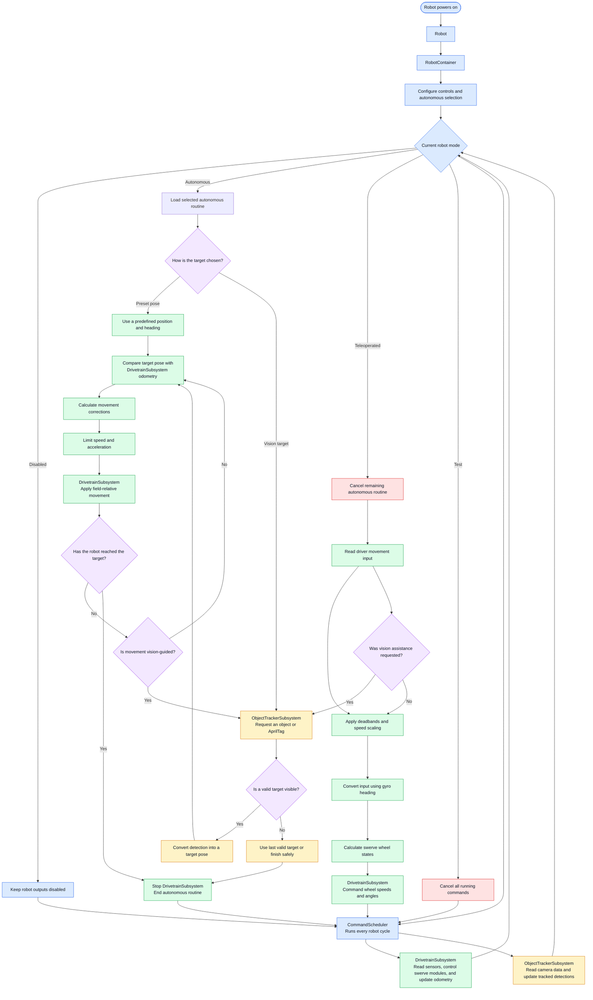

## Robot Code Flowchart

```mermaid
flowchart TD
    Start([Robot powers on]) --> Robot[Robot]
    Robot --> Container[RobotContainer]
    Container --> Bindings[Configure controls and autonomous selection]
    Bindings --> Mode{Current robot mode}

    Scheduler["CommandScheduler<br/>Runs every robot cycle"]
    Scheduler --> DTSPeriodic["DrivetrainSubsystem<br/>Read sensors, control swerve modules, and update odometry"]
    Scheduler --> OTSPeriodic["ObjectTrackerSubsystem<br/>Read camera data and update tracked detections"]
    DTSPeriodic --> Mode
    OTSPeriodic --> Mode

    Mode -->|Disabled| Disabled[Keep robot outputs disabled]
    Disabled --> Scheduler

    Mode -->|Autonomous| SelectAuto[Load selected autonomous routine]
    SelectAuto --> TargetType{How is the target chosen?}

    TargetType -->|Preset pose| PresetTarget[Use a predefined position and heading]
    TargetType -->|Vision target| RequestTarget["ObjectTrackerSubsystem<br/>Request an object or AprilTag"]

    RequestTarget --> Visible{Is a valid target visible?}
    Visible -->|Yes| CalculatePose[Convert detection into a target pose]
    Visible -->|No| NoTarget[Use last valid target or finish safely]

    PresetTarget --> Feedback
    CalculatePose --> Feedback
    NoTarget --> StopAuto

    Feedback["Compare target pose with<br/>DrivetrainSubsystem odometry"]
    Feedback --> Controller[Calculate movement corrections]
    Controller --> Limit[Limit speed and acceleration]
    Limit --> AutoDrive["DrivetrainSubsystem<br/>Apply field-relative movement"]
    AutoDrive --> Reached{Has the robot reached the target?}

    Reached -->|No| VisionBased{Is movement vision-guided?}
    VisionBased -->|Yes| RequestTarget
    VisionBased -->|No| Feedback
    Reached -->|Yes| StopAuto["Stop DrivetrainSubsystem<br/>End autonomous routine"]
    StopAuto --> Scheduler

    Mode -->|Teleoperated| CancelAuto[Cancel remaining autonomous routine]
    CancelAuto --> DriverInput[Read driver movement input]
    DriverInput --> ProcessInput[Apply deadbands and speed scaling]
    ProcessInput --> FieldRelative[Convert input using gyro heading]
    FieldRelative --> Kinematics[Calculate swerve wheel states]
    Kinematics --> DriveRobot["DrivetrainSubsystem<br/>Command wheel speeds and angles"]
    DriveRobot --> Scheduler

    DriverInput --> VisionRequested{Was vision assistance requested?}
    VisionRequested -->|Yes| RequestTarget
    VisionRequested -->|No| ProcessInput

    Mode -->|Test| TestMode[Cancel all running commands]
    TestMode --> Scheduler

    Mode --> Scheduler

    classDef lifecycle fill:#dbeafe,stroke:#2563eb,color:#111827
    classDef drivetrain fill:#dcfce7,stroke:#16a34a,color:#111827
    classDef vision fill:#fef3c7,stroke:#d97706,color:#111827
    classDef decision fill:#f3e8ff,stroke:#9333ea,color:#111827
    classDef safety fill:#fee2e2,stroke:#dc2626,color:#111827

    class Start,Robot,Container,Bindings,Scheduler,Mode,Disabled lifecycle
    class DTSPeriodic,PresetTarget,Feedback,Controller,Limit,AutoDrive,StopAuto,DriverInput,ProcessInput,FieldRelative,Kinematics,DriveRobot drivetrain
    class OTSPeriodic,RequestTarget,CalculatePose,NoTarget vision
    class TargetType,Visible,Reached,VisionBased,VisionRequested decision
    class CancelAuto,TestMode safety
```
